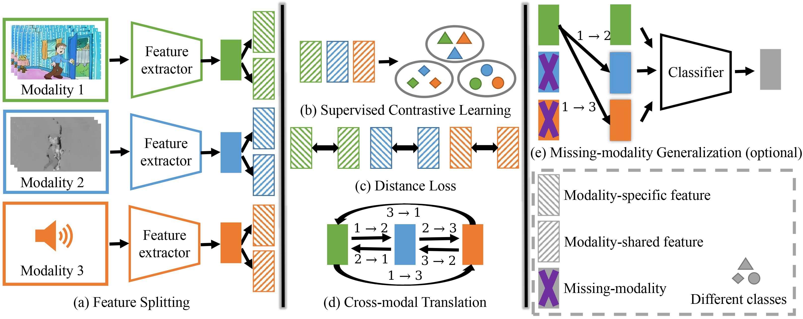

<div align="center">

<h1>SimMMDG: A Simple and Effective Framework for Multi-modal Domain Generalization</h1>

<div>
    <a href='https://sites.google.com/view/dong-hao/' target='_blank'>Hao Dong</a><sup>1</sup>&emsp;
    <a href='https://people.epfl.ch/ismail.nejjar' target='_blank'>Ismail Nejjar</a><sup>2</sup>&emsp;
    <a href='https://people.epfl.ch/han.sun?lang=en' target='_blank'>Han Sun</a><sup>2</sup>&emsp;
    <a href='https://chatzi.ibk.ethz.ch/about-us/people/prof-dr-eleni-chatzi.html' target='_blank'>Eleni Chatzi</a><sup>1</sup>&emsp;
    <a href='https://people.epfl.ch/olga.fink?lang=en' target='_blank'>Olga Fink</a><sup>2</sup>
</div>
<div>
    <sup>1</sup>ETH Zurich, <sup>2</sup>EPFL
</div>


<div>
    <h4 align="center">
        • <a href="https://arxiv.org/abs/2310.19795" target='_blank'>NeurIPS 2023</a> •
    </h4>
</div>


<div style="text-align:center">

</div>

---

</div>


Overview of SimMMDG. We split the features of each modality into modality-specific and modality-shared parts. For the modality-shared part, we use supervised contrastive learning to map the features with the same label to be as close as possible. For modality-specific features, we use a distance loss to encourage them to be far from modality-shared features, promoting diversity within each modality. Additionally, we introduce a cross-modal translation module that regularizes features and enhances generalization across missing modalities.

**Update**: We have a new survey paper on [Multimodal Adaptation and Generalization](https://arxiv.org/abs/2501.18592)

## Code
The code was tested using `Python 3.10.4`, `torch 1.11.0+cu113` and `NVIDIA GeForce RTX 3090`.

Environments:
```
mmcv-full 1.2.7
mmaction2 0.13.0
```
### EPIC-Kitchens Dataset
### Prepare

#### Download Pretrained Weights
1. Download Audio model [link](http://www.robots.ox.ac.uk/~vgg/data/vggsound/models/H.pth.tar), rename it as `vggsound_avgpool.pth.tar` and place under the `EPIC-rgb-flow-audio/pretrained_models` directory
   
2. Download SlowFast model for RGB modality [link](https://download.openmmlab.com/mmaction/recognition/slowfast/slowfast_r101_8x8x1_256e_kinetics400_rgb/slowfast_r101_8x8x1_256e_kinetics400_rgb_20210218-0dd54025.pth) and place under the `EPIC-rgb-flow-audio/pretrained_models` directory
   
3. Download SlowOnly model for Flow modality [link](https://download.openmmlab.com/mmaction/recognition/slowonly/slowonly_r50_8x8x1_256e_kinetics400_flow/slowonly_r50_8x8x1_256e_kinetics400_flow_20200704-6b384243.pth) and place under the `EPIC-rgb-flow-audio/pretrained_models` directory

#### Download EPIC-Kitchens Dataset
```
bash download_script.sh 
```
Download Audio files [EPIC-KITCHENS-audio.zip](https://huggingface.co/datasets/hdong51/Human-Animal-Cartoon/blob/main/EPIC-KITCHENS-audio.zip).

Unzip all files and the directory structure should be modified to match:
<details>
<summary>Click for details...</summary>


```
├── MM-SADA_Domain_Adaptation_Splits
├── rgb
|   ├── train
|   |   ├── D1
|   |   |   ├── P08_01.wav
|   |   |   ├── P08_01
|   |   |   |     ├── frame_0000000000.jpg
|   |   |   |     ├── ...
|   |   |   ├── P08_02.wav
|   |   |   ├── P08_02
|   |   |   ├── ...
|   |   ├── D2
|   |   ├── D3
|   ├── test
|   |   ├── D1
|   |   ├── D2
|   |   ├── D3


├── flow
|   ├── train
|   |   ├── D1
|   |   |   ├── P08_01 
|   |   |   |   ├── u
|   |   |   |   |   ├── frame_0000000000.jpg
|   |   |   |   |   ├── ...
|   |   |   |   ├── v
|   |   |   ├── P08_02
|   |   |   ├── ...
|   |   ├── D2
|   |   ├── D3
|   ├── test
|   |   ├── D1
|   |   ├── D2
|   |   ├── D3
```

</details>


### Video and Audio
<details>
<summary>Click for details...</summary>


```
cd EPIC-rgb-flow-audio
```
```
python train_video_flow_audio_EPIC_SimMMDG.py --use_video --use_audio -s D2 D3 -t D1 --lr 1e-4 --bsz 16 --nepochs 20 --datapath /path/to/EPIC-KITCHENS/
```
```
python train_video_flow_audio_EPIC_SimMMDG.py --use_video --use_audio -s D1 D3 -t D2 --lr 1e-4 --bsz 16 --nepochs 20 --datapath /path/to/EPIC-KITCHENS/
```
```
python train_video_flow_audio_EPIC_SimMMDG.py --use_video --use_audio -s D1 D2 -t D3 --lr 1e-4 --bsz 16 --nepochs 25 --datapath /path/to/EPIC-KITCHENS/
```

</details>


### Video and Flow
<details>
<summary>Click for details...</summary>


```
cd EPIC-rgb-flow-audio
```
```
python train_video_flow_audio_EPIC_SimMMDG.py --use_video --use_flow -s D2 D3 -t D1 --lr 1e-4 --bsz 16 --nepochs 15 --datapath /path/to/EPIC-KITCHENS/
```
```
python train_video_flow_audio_EPIC_SimMMDG.py --use_video --use_flow -s D1 D3 -t D2 --lr 1e-4 --bsz 16 --nepochs 15 --datapath /path/to/EPIC-KITCHENS/
```
```
python train_video_flow_audio_EPIC_SimMMDG.py --use_video --use_flow -s D1 D2 -t D3 --lr 1e-4 --bsz 16 --nepochs 15 --datapath /path/to/EPIC-KITCHENS/
```

</details>


### Flow and Audio
<details>
<summary>Click for details...</summary>


```
cd EPIC-rgb-flow-audio
```
```
python train_video_flow_audio_EPIC_SimMMDG.py --use_flow --use_audio -s D2 D3 -t D1 --lr 1e-4 --bsz 16 --nepochs 10 --datapath /path/to/EPIC-KITCHENS/
```
```
python train_video_flow_audio_EPIC_SimMMDG.py --use_flow --use_audio -s D1 D3 -t D2 --lr 1e-4 --bsz 16 --nepochs 20 --datapath /path/to/EPIC-KITCHENS/
```
```
python train_video_flow_audio_EPIC_SimMMDG.py --use_flow --use_audio -s D1 D2 -t D3 --lr 1e-4 --bsz 16 --nepochs 20 --datapath /path/to/EPIC-KITCHENS/
```

</details>


### Video and Flow and Audio
<details>
<summary>Click for details...</summary>


```
cd EPIC-rgb-flow-audio
```
```
python train_video_flow_audio_EPIC_SimMMDG.py --use_video --use_flow --use_audio -s D2 D3 -t D1 --lr 1e-4 --bsz 16 --nepochs 10 --trans_hidden_num 1024 --datapath /path/to/EPIC-KITCHENS/
```
```
python train_video_flow_audio_EPIC_SimMMDG.py --use_video --use_flow --use_audio -s D1 D3 -t D2 --lr 1e-4 --bsz 16 --nepochs 20 --datapath /path/to/EPIC-KITCHENS/
```
```
python train_video_flow_audio_EPIC_SimMMDG.py --use_video --use_flow --use_audio -s D1 D2 -t D3 --lr 1e-4 --bsz 16 --nepochs 15 --alpha_trans 1.0 --datapath /path/to/EPIC-KITCHENS/
```

</details>


### HAC Dataset
This dataset can be downloaded at [link](https://huggingface.co/datasets/hdong51/Human-Animal-Cartoon/tree/main).

Unzip all files and the directory structure should be modified to match:
<details>
<summary>Click for details...</summary>


```
HAC
├── human
|   ├── videos
|   |   ├── ...
|   ├── flow
|   |   ├── ...
|   ├── audio
|   |   ├── ...

├── animal
|   ├── videos
|   |   ├── ...
|   ├── flow
|   |   ├── ...
|   ├── audio
|   |   ├── ...

├── cartoon
|   ├── videos
|   |   ├── ...
|   ├── flow
|   |   ├── ...
|   ├── audio
|   |   ├── ...
```

</details>


Download the pretrained weights similar to EPIC-Kitchens Dataset and put under the `HAC-rgb-flow-audio/pretrained_models` directory.

### Video and Audio
<details>
<summary>Click for details...</summary>


```
cd HAC-rgb-flow-audio
```
```
python train_video_flow_audio_HAC_SimMMDG.py --use_video --use_audio -s 'animal' 'cartoon' -t 'human' --lr 1e-4 --bsz 16 --nepochs 10 --datapath /path/to/HAC/
```
```
python train_video_flow_audio_HAC_SimMMDG.py --use_video --use_audio -s 'human' 'cartoon' -t 'animal' --lr 1e-4 --bsz 16 --nepochs 10 --datapath /path/to/HAC/
```
```
python train_video_flow_audio_HAC_SimMMDG.py --use_video --use_audio -s 'human' 'animal' -t 'cartoon' --lr 1e-4 --bsz 16 --nepochs 10 --datapath /path/to/HAC/
```

</details>


### Video and Flow
<details>
<summary>Click for details...</summary>


```
cd HAC-rgb-flow-audio
```
```
python train_video_flow_audio_HAC_SimMMDG.py --use_video --use_flow -s 'animal' 'cartoon' -t 'human' --lr 1e-4 --bsz 16 --nepochs 20 --datapath /path/to/HAC/
```
```
python train_video_flow_audio_HAC_SimMMDG.py --use_video --use_flow -s 'human' 'cartoon' -t 'animal' --lr 1e-4 --bsz 16 --nepochs 20 --datapath /path/to/HAC/
```
```
python train_video_flow_audio_HAC_SimMMDG.py --use_video --use_flow -s 'human' 'animal' -t 'cartoon' --lr 1e-4 --bsz 16 --nepochs 20 --datapath /path/to/HAC/
```

</details>


### Flow and Audio
<details>
<summary>Click for details...</summary>


```
cd HAC-rgb-flow-audio
```
```
python train_video_flow_audio_HAC_SimMMDG.py --use_flow --use_audio -s 'animal' 'cartoon' -t 'human' --lr 1e-4 --bsz 16 --nepochs 15 --datapath /path/to/HAC/
```
```
python train_video_flow_audio_HAC_SimMMDG.py --use_flow --use_audio -s 'human' 'cartoon' -t 'animal' --lr 1e-4 --bsz 16 --nepochs 15 --datapath /path/to/HAC/
```
```
python train_video_flow_audio_HAC_SimMMDG.py --use_flow --use_audio -s 'human' 'animal' -t 'cartoon' --lr 1e-4 --bsz 16 --nepochs 20 --datapath /path/to/HAC/
```

</details>


### Video and Flow and Audio
<details>
<summary>Click for details...</summary>


```
cd HAC-rgb-flow-audio
```
```
python train_video_flow_audio_HAC_SimMMDG.py --use_video --use_flow --use_audio -s 'animal' 'cartoon' -t 'human' --lr 1e-4 --bsz 16 --nepochs 15 --datapath /path/to/HAC/
```
```
python train_video_flow_audio_HAC_SimMMDG.py --use_video --use_flow --use_audio -s 'human' 'cartoon' -t 'animal' --lr 1e-4 --bsz 16 --nepochs 10 --datapath /path/to/HAC/
```
```
python train_video_flow_audio_HAC_SimMMDG.py --use_video --use_flow --use_audio -s 'human' 'animal' -t 'cartoon' --lr 1e-4 --bsz 16 --nepochs 15 --datapath /path/to/HAC/
```

</details>


## Contact
If you have any questions, please send an email to donghaospurs@gmail.com

## Citation

If you find our work useful in your research please consider citing our paper:

```
@inproceedings{dong2023SimMMDG,
    title={Sim{MMDG}: A Simple and Effective Framework for Multi-modal Domain Generalization},
    author={Dong, Hao and Nejjar, Ismail and Sun, Han and Chatzi, Eleni and Fink, Olga},
    booktitle={Advances in Neural Information Processing Systems (NeurIPS)},
    year={2023}
}
```

## Related Projects

[MOOSA](https://github.com/donghao51/MOOSA): Towards Multimodal Open-Set Domain Generalization and Adaptation through Self-supervision

[AEO](https://github.com/donghao51/AEO): Towards Robust Multimodal Open-set Test-time Adaptation via Adaptive Entropy-aware Optimization

[Survey](https://github.com/donghao51/Awesome-Multimodal-Adaptation): Advances in Multimodal Adaptation and Generalization: From Traditional Approaches to Foundation Models

[MultiOOD](https://github.com/donghao51/MultiOOD): Scaling Out-of-Distribution Detection for Multiple Modalities

## Acknowledgement

Many thanks to the open-source project [DomainAdaptation](https://github.com/xiaobai1217/DomainAdaptation).
